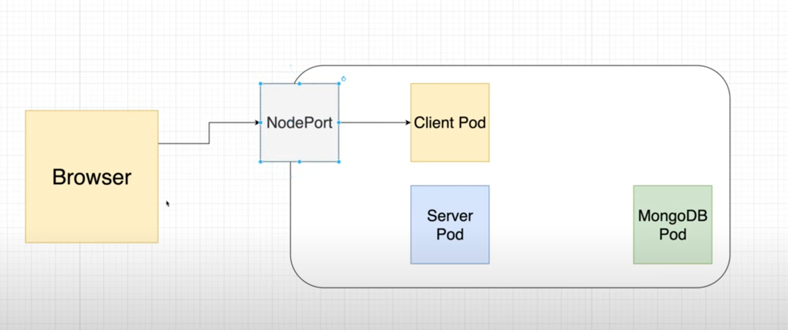

# k8s Training


## Creating a cluster

``` bash
kind create cluster
```


## Deploying a pod

React client app

``` bash
kubectl apply -f ./pod/create-pod.yaml
```

note: https://hub.docker.com/r/laithharb

### View Logs

1. View Lens
2. View with stern

``` bash
stern .* -n default -s 10m --tail 100
``` 

``` bash
stern .* -n default -s 10m -i img
```

### Delete Pod

``` bash
kubectl delete -f ./pod/create-pod.yaml
```

## Deploy a Service

``` bash
kubectl apply -f ./service/create-service.yaml
```


## Deploy a Deployment
``` bash
kubectl apply -f ./deployment/client-depl.yaml
kubectl apply -f ./deployment/mongo-depl.yaml
kubectl apply -f ./deployment/serve-depl.yaml
```


## Networking

